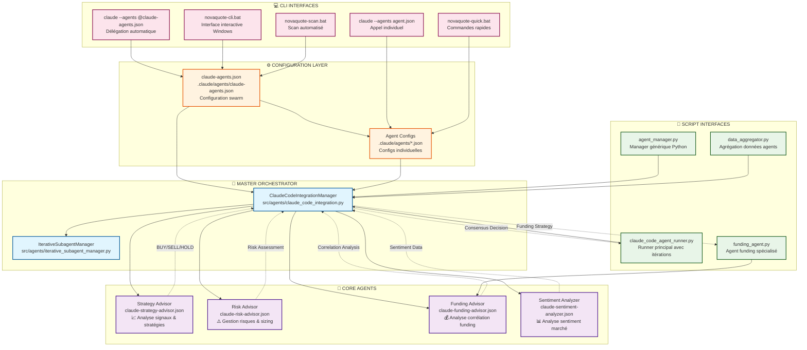
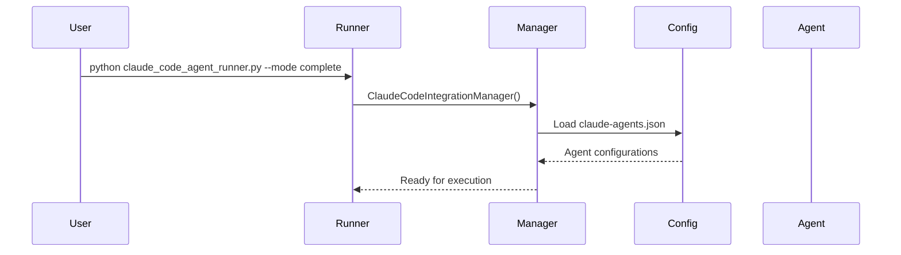
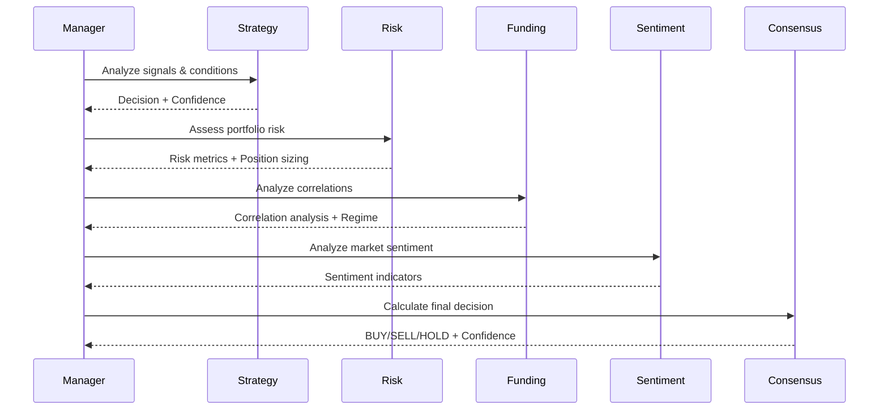
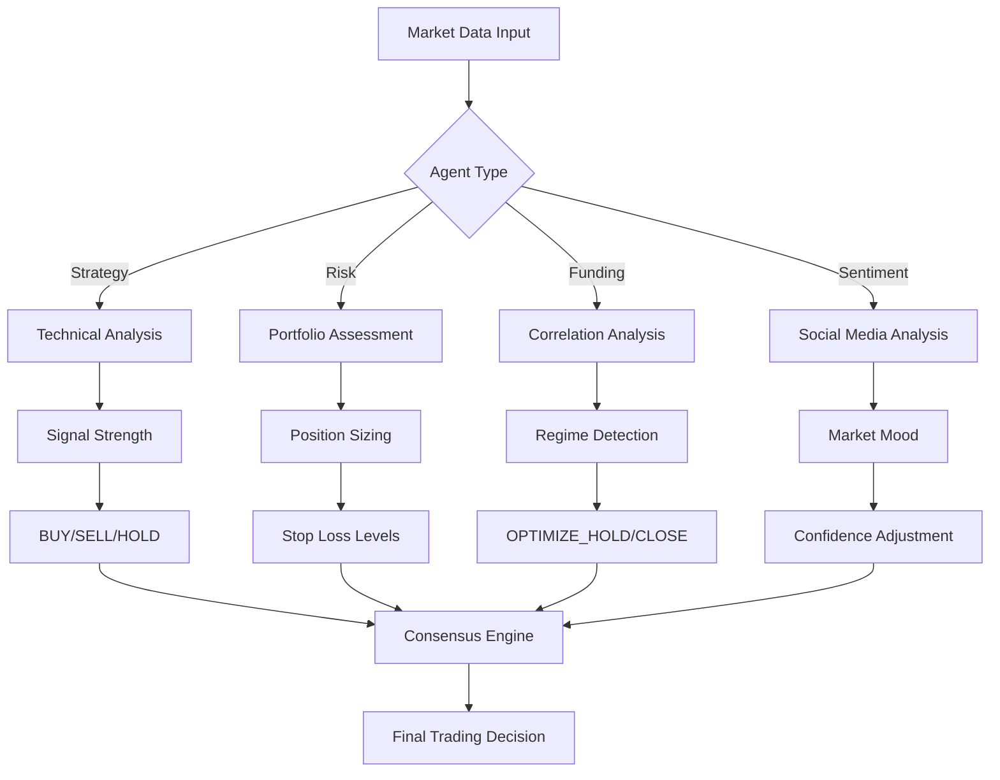

# 🏗️ Architecture des Agents NOVAQUOTE - Diagramme de Flux

## 📊 Diagramme Complet du Système d'Agents



## 🔄 Flux de Fonctionnement Détaillé

### **1. Initialisation du Système**


### **2. Exécution d'Analyse Complète**


### **3. Flux de Données par Agent**


## 🎯 Points d'Entrée du Système

### **A. Via Scripts Python**
```python
# 1. Runner Principal
python scripts/claude_code_agent_runner.py --mode complete

# 2. Agent Spécialisé
python src/agents/funding_agent.py

# 3. Manager Générique
from src.agents.agent_manager import NovaQuoteAgentManager
manager = NovaQuoteAgentManager()
result = manager.run_agent("funding-advisor", "Analyze BTC correlations")
```

### **B. Via Interface CLI**
```bash
# 1. Délégation Automatique
claude --agents @claude-agents.json --print --dangerously-skip-permissions "Complete analysis"

# 2. Agent Individuel
claude --agents .claude/agents/claude-funding-advisor.json --print --dangerously-skip-permissions "Correlation analysis"

# 3. Scripts Batch Windows
novaquote-cli.bat          # Interface interactive
novaquote-quick.bat all    # Analyse complète
novaquote-scan.bat         # Scan automatisé
```

## 🔧 Architecture Technique

### **Couches du Système**
```
┌─────────────────┐
│   CLI Layer     │ ← Scripts batch, commandes directes
├─────────────────┤
│ Script Layer    │ ← Python runners, managers spécialisés
├─────────────────┤
│ Orchestrator    │ ← ClaudeCodeIntegrationManager
├─────────────────┤
│ Iteration Engine│ ← IterativeSubagentManager
├─────────────────┤
│  Agent Layer    │ ← Sub-agents Claude spécialisés
├─────────────────┤
│ Config Layer    │ ← JSON configurations
└─────────────────┘
```

### **Types d'Exécution**
1. **Synchrone** : Appel direct d'un agent
2. **Itératif** : Amélioration progressive avec convergence
3. **Parallèle** : Exécution simultanée de plusieurs agents
4. **Délégation** : Routage automatique vers agent approprié

### **Gestion d'État**
- **Session Management** : Suivi des itérations par session
- **Convergence Metrics** : Mesure de stabilité des décisions
- **Confidence Scoring** : Niveau de confiance par agent
- **Consensus Calculation** : Agrégation des recommandations

## 📈 Métriques et Monitoring

### **Indicateurs Clés**
- **Convergence Rate** : % d'agents ayant convergé
- **Confidence Average** : Confiance moyenne des décisions
- **Execution Time** : Temps de réponse par agent
- **Success Rate** : Taux de succès des appels

### **Rapports Générés**
- **Analysis Reports** : `reports/claude_code/analysis_*.json`
- **Agent Logs** : `reports/agents/agent_*.json`
- **Performance Metrics** : Métriques d'exécution et convergence

---

## 🎯 Résumé Architecture

Le système NOVAQUOTE utilise une **architecture modulaire multi-couches** avec :

- **4 agents spécialisés** (Strategy, Risk, Funding, Sentiment)
- **3 modes d'accès** (CLI, Scripts Python, API)
- **2 moteurs principaux** (Orchestrateur + Itération)
- **Système de consensus** pour décisions finales

Chaque agent peut être appelé **individuellement** ou **via orchestration complète**, avec support pour **itérations avancées** et **convergence automatique**.

Le **ClaudeCodeIntegrationManager** sert de **chef d'orchestre** coordonnant tous les agents selon les patterns documentés dans `COMMANDS_AGENTS_GUIDE.md`. 🚀
