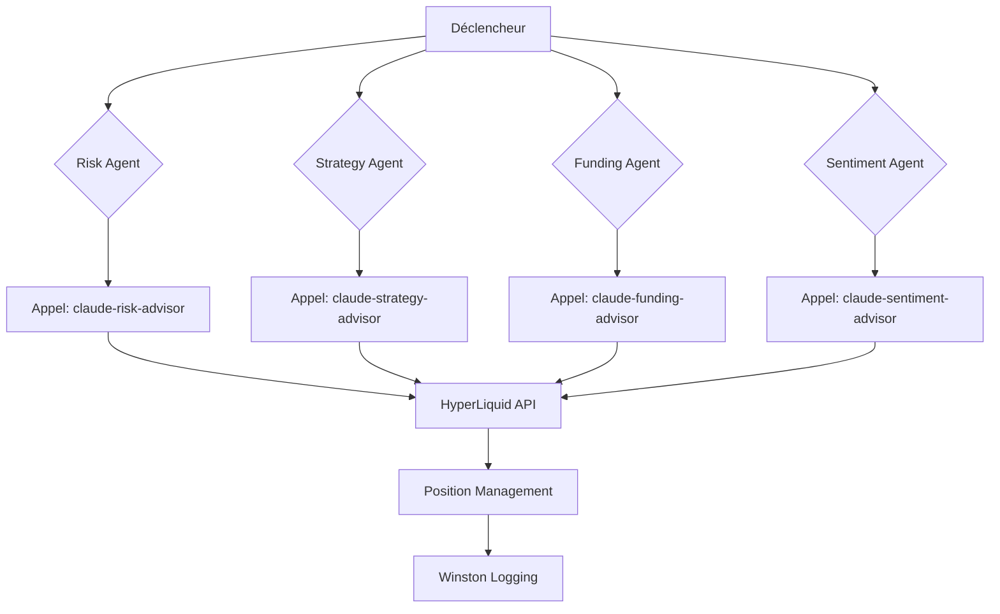

# Agents IA - Fonctionnement Réel

## Vue d'ensemble (4 agents)



## Pattern Technique

```python
def call_subagent(self, prompt, context_data=None):
    cmd = ["claude", "--dangerously-skip-permissions", "--agent", self.subagent_name, prompt]
    return subprocess.run(cmd, timeout=120).stdout
```

## Architecture

Market Data → Claude Sub-Agents → Strategy Library → Order Execution

## Métriques

- **funding_agent.py**: Sub-agent claude-funding-advisor
- **risk_agent.py**: Sub-agent claude-risk-advisor
- **sentiment_analysis_agent.py**: Sub-agent claude-sentiment_analysis-advisor
- **strategy_agent.py**: Sub-agent claude-strategy-advisor

---

_Claude Code sub-agents exclusivement_
