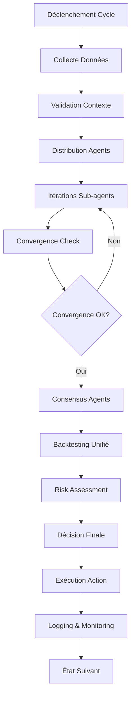

# 🏗️ Architecture Complète des Agents Claude Code

**Documentation technique complète du système multi-agents NOVAQUOTE avec Claude Code**

---

## 📋 Table des Matières

1. [Vue d'ensemble](#-vue-densemble)
2. [Communication Claude Code](#-communication-claude-code)
3. [Flux Entrées/Sorties](#-flux-entréessorties)
4. [Système d'Itération](#-système-ditération)
5. [Gestion Mémoire](#-gestion-mémoire)
6. [Cycle de Vie](#-cycle-de-vie)
7. [Gestion Erreurs](#-gestion-erreurs)
8. [Performance](#-performance)
9. [Monitoring](#-monitoring)

---

## 🎯 Vue d'ensemble

### Architecture Multi-Couches

```
┌─────────────────────────────────────────────────────────┐
│                 MASTER AGENT                           │
│          (Coordinateur Central - 20min cycles)          │
│  • Orchestration globale                               │
│  • Validation de décisions                             │
│  • Backtesting unifié                                  │
├─────────────────────────────────────────────────────────┤
│  Strategy Agent  │  Risk Agent  │  Funding Agent  │    │
│   (Signaux)      │  (Sécurité)  │   (Arbitrage)   │    │
│                  │              │                 │    │
│  Sentiment Agent │  Liquidity   │  Execution      │    │
│   (Social)       │   Agent      │    Agent        │    │
├─────────────────────────────────────────────────────────┤
│       ITERATIVE SUBAGENT MANAGER (Multi-itérations)     │
│  • 5 stratégies d'itération                            │
│  • Convergence automatique                             │
│  • Session management                                  │
├─────────────────────────────────────────────────────────┤
│      PERSISTENT AGENT ORCHESTRATOR (Processus)         │
│  • Gestion états persistants                           │
│  • Auto-récupération                                   │
│  • Monitoring                                          │
└─────────────────────────────────────────────────────────┘
```

### Hiérarchie des Agents

1. **Master Agent** - Coordinateur central (cycles 20min)
2. **Base Agent** - Classe fondamentale avec état
3. **Iterative Manager** - Système multi-itérations
4. **Specialized Agents** - 4 agents métiers
5. **Claude Code Sub-agents** - Intelligence externe

---

## 🔌 Communication Claude Code

### Pattern d'Appel Standard

```python
def call_subagent(self, prompt: str, context_data: dict = None) -> str:
    """
    Communication standardisée avec les sub-agents Claude Code
    """
    # 1. Construction du prompt complet
    full_prompt = f"""Use the {self.subagent_name} subagent to analyze:

{prompt}

Context Data:
{json.dumps(context_data, indent=2) if context_data else 'N/A'}

Please provide detailed analysis with clear recommendations."""

    # 2. Commande Claude Code CLI
    cmd = [
        "claude",                                    # Exécutable Claude Code
        "--dangerously-skip-permissions",            # Skip permissions
        "--agent",                                   # Spécifier sub-agent
        self.subagent_name,                         # Nom du sub-agent
        full_prompt,                                # Prompt avec contexte
    ]

    # 3. Exécution sécurisée
    result = subprocess.run(
        cmd,
        capture_output=True,
        text=True,
        timeout=120,                                # 2 minutes timeout
        cwd=os.getcwd(),
    )

    # 4. Gestion des erreurs
    if result.returncode != 0:
        raise RuntimeError(f"Sub-agent error: {result.stderr}")

    return result.stdout
```

### Sub-Agents Disponibles

| Sub-Agent                   | Rôle Principal    | Spécialisation             | Timeout | Fichier              |
| --------------------------- | ----------------- | -------------------------- | ------- | -------------------- |
| `claude-risk-advisor`       | Gestion Risque    | Position sizing, stop-loss | 120s    | `risk_agent.py`      |
| `claude-strategy-advisor`   | Analyse Technique | Signaux, backtesting       | 120s    | `strategy_agent.py`  |
| `claude-funding-advisor`    | Arbitrage Funding | Taux, opportunités         | 120s    | `funding_agent.py`   |
| `claude-sentiment-analyzer` | Sentiment Marché  | Social, news, Twitter      | 120s    | `sentiment_agent.py` |

### Format des Prompts

```python
# Structure de prompt standard
prompt_structure = f"""
Use the {self.subagent_name} subagent to analyze this scenario:

=== ANALYSIS REQUEST ===
{user_prompt}

=== CONTEXT DATA ===
{
  "symbol": "BTC",
  "timestamp": "2025-01-01T00:00:00Z",
  "market_data": {...},
  "portfolio_state": {...},
  "risk_parameters": {...}
}

=== EXPECTED OUTPUT FORMAT ===
{
  "decision": "BUY/SELL/HOLD",
  "confidence": 0.0-1.0,
  "reasoning": "detailed explanation",
  "risk_score": 0.0-1.0,
  "execution_details": {...}
}
"""
```

---

## 📊 Flux Entrées/Sorties

### Architecture des Flux

```
┌─────────────────┐    ┌─────────────────┐    ┌─────────────────┐
│   Market Data   │ →  │   Agent Local   │ →  │ Claude Code CLI │
│                 │    │   Analysis      │    │                 │
│ • HyperLiquid   │    │ • Preprocessing │    │ • Sub-agent     │
│ • Prices        │    │ • Validation    │    │ • AI Processing│
│ • Volume        │    │ • Context       │    │ • Response      │
└─────────────────┘    └─────────────────┘    └─────────────────┘
         ↓                       ↓                       ↓
┌─────────────────┐    ┌─────────────────┐    ┌─────────────────┐
│  Action Output  │ ←  │ Decision Logic  │ ←  │ AI Response     │
│                 │    │                 │    │                 │
│ • Order Exec    │    │ • Confidence    │    │ • JSON Parse    │
│ • Risk Update   │    │ • Validation    │    │ • Extract Data  │
│ • Portfolio     │    │ • Backtest      │    │ • Score Calc    │
└─────────────────┘    └─────────────────┘    └─────────────────┘
```

### Structure des Données

#### **Entrée Standard**

```python
input_schema = {
    "symbol": str,              # "BTC", "ETH", etc.
    "timestamp": str,           # ISO 8601 format
    "market_data": {
        "price": float,
        "volume": float,
        "funding_rate": float,
        "liquidity": float,
        "volatility": float
    },
    "portfolio_state": {
        "positions": List[Dict],
        "balance": float,
        "available_margin": float,
        "pnl": float
    },
    "risk_parameters": {
        "max_position_size": float,
        "max_risk_per_trade": float,
        "stop_loss_pct": float
    },
    "agent_specific_context": dict  # Contexte spécifique
}
```

#### **Sortie Standard**

```python
output_schema = {
    "decision": str,            # "BUY"/"SELL"/"HOLD"
    "confidence": float,        # 0.0 - 1.0
    "reasoning": str,           # Explication détaillée
    "risk_score": float,        # 0.0 - 1.0
    "metadata": {
        "strategy_used": str,
        "execution_details": {
            "entry_price": float,
            "position_size": float,
            "stop_loss": float,
            "take_profit": float
        },
        "backtest_results": {
            "win_rate": float,
            "avg_return": float,
            "max_drawdown": float
        },
        "timing": {
            "analysis_time_ms": float,
            "confidence_calculation_ms": float
        }
    }
}
```

### Flux de Communication

```python
# 1. Réception des données
def process_market_data(self, market_update):
    # Validation et preprocessing
    validated_data = self._validate_input(market_update)

    # Enrichissement contexte
    context = self._build_context(validated_data)

    # Appel sub-agent
    ai_response = self.call_subagent(prompt, context)

    # Extraction et validation
    result = self._parse_ai_response(ai_response)

    # Action exécution
    return self._execute_decision(result)
```

---

## 🔄 Système d'Itération

### Stratégies d'Itération Avancées

Le `IterativeSubagentManager` implémente 5 stratégies sophistiquées :

#### 1. **Progressive Refinement** (Affinage Progressif)

```python
def _progressive_refinement(self, prompt: str, context_data: dict, session):
    current_prompt = prompt
    accumulated_context = context_data.copy()

    for iteration in range(1, session.config.max_iterations + 1):
        # Ajouter réponses précédentes au contexte
        if session.responses:
            accumulated_context["previous_responses"] = [
                {
                    "iteration": r.iteration,
                    "response": r.response,
                    "confidence": r.confidence,
                }
                for r in session.responses
            ]

        # Appeler sub-agent avec contexte enrichi
        response = self._make_subagent_call(current_prompt, accumulated_context, iteration, session.config)
        session.responses.append(response)

        # Vérifier convergence
        if response.confidence >= session.config.confidence_threshold:
            break

        # Préparer prochain prompt avec feedback
        current_prompt = self._create_refinement_prompt(response, accumulated_context)

    return self._select_best_response(session.responses)
```

#### 2. **Cross Validation** (Validation Croisée)

```python
def _cross_validation(self, prompt: str, context_data: dict, session):
    perspectives = []

    for i in range(session.config.max_iterations):
        # Variations du prompt pour perspectives différentes
        variant_prompt = self._create_perspective_variant(prompt, i)

        response = self._make_subagent_call(variant_prompt, context_data, i+1, session.config)
        perspectives.append(response)

    # Consensus par vote majoritaire
    return self._majority_vote_consensus(perspectives)
```

#### 3. **Convergence Seeking** (Recherche Convergence)

```python
def _convergence_seeking(self, prompt: str, context_data: dict, session):
    previous_response = None
    stability_threshold = session.config.stability_threshold

    for iteration in range(1, session.config.max_iterations + 1):
        response = self._make_subagent_call(prompt, context_data, iteration, session.config)
        session.responses.append(response)

        # Calculer stabilité
        if previous_response:
            stability = self._calculate_response_similarity(response, previous_response)
            if stability >= stability_threshold:
                break  # Convergence atteinte

        previous_response = response

    return response
```

### Calcul de Convergence

```python
def _calculate_convergence_metrics(self, responses: List[SubagentResponse]) -> Dict[str, float]:
    """
    Métriques sophistiquées de convergence
    """

    # 1. Stability : similarité entre réponses consécutives
    stability_scores = []
    for i in range(1, len(responses)):
        similarity = self._calculate_response_similarity(responses[i], responses[i-1])
        stability_scores.append(similarity)

    stability = sum(stability_scores) / len(stability_scores) if stability_scores else 1.0

    # 2. Confidence Trend : amélioration de confiance
    confidence_trend = responses[-1].confidence - responses[0].confidence

    # 3. Consistency : variance en confiance
    confidences = [r.confidence for r in responses]
    avg_confidence = sum(confidences) / len(confidences)
    variance = sum((c - avg_confidence) ** 2 for c in confidences) / len(confidences)
    consistency = 1 - min(1.0, variance)

    return {
        "stability": stability,           # 0.0 - 1.0
        "confidence_trend": confidence_trend,  # Peut être négatif
        "consistency": consistency,       # 0.0 - 1.0
        "final_confidence": responses[-1].confidence if responses else 0,
        "iterations_used": len(responses),
        "converged": stability >= 0.8 and consistency >= 0.7
    }
```

### Configuration des Sessions

```python
@dataclass
class IterationConfig:
    max_iterations: int = 5              # Max 5 itérations
    timeout_per_iteration: int = 120     # 2 minutes par itération
    confidence_threshold: float = 0.85   # 85% de confiance requis
    stability_threshold: float = 0.8     # 80% de stabilité
    strategy: IterationStrategy = IterationStrategy.PROGRESSIVE_REFINEMENT
    enable_caching: bool = True
    cache_duration: int = 3600           # 1 heure
```

---

## 🧠 Gestion Mémoire

### Architecture Mémoire Multi-Niveaux

#### 1. **État Persistant (Base Agent)**

```python
class BaseAgent:
    def __init__(self, agent_type: str, enable_postgres: bool = False):
        self.agent_type = agent_type
        self.state = {}                    # État courant
        self.data_dir = Path(__file__).parent.parent / "data" / agent_type
        self.state_file = self.data_dir / "agent_state.json"

    def save_state(self):
        """Sauvegarde atomique de l'état"""
        state_data = {
            "agent_type": self.agent_type,
            "start_time": self.start_time,
            "last_update": datetime.now().isoformat(),
            "is_running": self.is_running,
            "state": self.state,
            "metadata": {
                "version": "1.0",
                "total_cycles": self.total_cycles,
                "last_error": self.last_error
            }
        }

        # Sauvegarde atomique (tempfile -> rename)
        temp_file = self.state_file.with_suffix('.tmp')
        try:
            with open(temp_file, "w") as f:
                json.dump(state_data, f, indent=2)
            temp_file.rename(self.state_file)
        except Exception as e:
            logger.error(f"Failed to save state: {e}")

    def load_state(self):
        """Chargement avec validation"""
        if self.state_file.exists():
            try:
                with open(self.state_file, "r") as f:
                    state_data = json.load(f)

                # Validation des données
                if self._validate_state_data(state_data):
                    self.state = state_data.get("state", {})
                    self.start_time = state_data.get("start_time", datetime.now().isoformat())
                    logger.info(f"Loaded state for {self.agent_type}")
                else:
                    logger.warning("Invalid state data, starting fresh")

            except Exception as e:
                logger.error(f"Failed to load state: {e}")
```

#### 2. **Mémoire de Cycle (Master Agent)**

```python
@dataclass
class CycleMetrics:
    """Métriques complètes d'un cycle de décision"""
    cycle_id: str
    start_time: str
    end_time: str
    duration_ms: float

    # Résultats des agents
    agents_results: List[AgentResult]

    # Décision finale
    combined_decision: str
    decision_confidence: float
    consensus_score: float

    # Validation
    backtests_validation: Dict[str, Any]
    risk_assessment: Dict[str, float]

    # Performance
    execution_summary: Dict[str, Any]
    performance_metrics: Dict[str, float]

    # Prochain cycle
    next_cycle_time: str

    def to_dict(self) -> Dict[str, Any]:
        """Sérialisation pour stockage"""
        return asdict(self)
```

#### 3. **Cache Intelligent**

```python
class IntelligentCache:
    def __init__(self, cache_dir: Path):
        self.cache_dir = cache_dir
        self.cache_duration = 3600  # 1 heure

    def get(self, key: str) -> Optional[Any]:
        """Récupération avec validation TTL"""
        cache_file = self.cache_dir / f"{key}.json"

        if cache_file.exists():
            try:
                with open(cache_file, "r") as f:
                    cache_data = json.load(f)

                # Vérifier TTL
                cache_time = datetime.fromisoformat(cache_data["timestamp"])
                if (datetime.now() - cache_time).seconds < self.cache_duration:
                    return cache_data["data"]
                else:
                    cache_file.unlink()  # Supprimer cache expiré

            except Exception as e:
                logger.error(f"Cache get error: {e}")

        return None

    def set(self, key: str, data: Any):
        """Stockage avec métadonnées"""
        cache_file = self.cache_dir / f"{key}.json"
        cache_data = {
            "timestamp": datetime.now().isoformat(),
            "data": data
        }

        try:
            with open(cache_file, "w") as f:
                json.dump(cache_data, f, indent=2)
        except Exception as e:
            logger.error(f"Cache set error: {e}")
```

#### 4. **Historique des Sessions**

```python
@dataclass
class IterationSession:
    """Session complète d'itérations"""
    session_id: str
    start_time: datetime
    config: IterationConfig
    initial_prompt: str
    context_data: dict
    responses: List[SubagentResponse] = field(default_factory=list)
    convergence_metrics: Optional[Dict[str, float]] = None

    def add_response(self, response: SubagentResponse):
        """Ajout réponse avec métadonnées"""
        self.responses.append(response)

        # Calcul automatique des métriques de convergence
        if len(self.responses) > 1:
            self.convergence_metrics = self._calculate_convergence()

    def get_final_response(self) -> Optional[SubagentResponse]:
        """Sélection de la meilleure réponse"""
        if not self.responses:
            return None

        # Stratégie de sélection basée sur convergence
        if self.convergence_metrics and self.convergence_metrics["converged"]:
            # Prendre la dernière réponse (convergée)
            return self.responses[-1]
        else:
            # Prendre celle avec la plus haute confiance
            return max(self.responses, key=lambda r: r.confidence)
```

---

## 🔄 Cycle de Vie Complet

### Déroulement d'un Cycle de Décision



### Étape 1: Initialisation du Cycle

```python
async def start_cycle(self):
    """Démarre un nouveau cycle de décision"""
    cycle_id = f"cycle_{int(time.time())}"
    start_time = datetime.now()

    # Initialiser les métriques du cycle
    cycle_metrics = CycleMetrics(
        cycle_id=cycle_id,
        start_time=start_time.isoformat(),
        end_time="",
        duration_ms=0,
        agents_results=[],
        combined_decision="",
        decision_confidence=0.0,
        consensus_score=0.0,
        backtests_validation={},
        risk_assessment={},
        execution_summary={},
        performance_metrics={},
        next_cycle_time=""
    )

    logger.info(f"Starting cycle {cycle_id}")
    return cycle_metrics
```

### Étape 2: Collecte et Validation des Données

```python
async def collect_market_data(self):
    """Collecte et validation des données marché"""
    try:
        # Collecte depuis HyperLiquid
        market_data = await self.hyperliquid_client.get_market_data()

        # Validation et nettoyage
        validated_data = self._validate_market_data(market_data)

        # Enrichissement avec données historiques
        enriched_data = await self._enrich_with_historical_data(validated_data)

        return enriched_data

    except Exception as e:
        logger.error(f"Market data collection failed: {e}")
        raise
```

### Étape 3: Distribution aux Agents

```python
async def distribute_to_agents(self, market_data: dict, cycle_metrics: CycleMetrics):
    """Distribution parallèle aux agents spécialisés"""

    agents_tasks = []

    # Lancement parallèle des agents
    for agent_name, agent in self.specialized_agents.items():
        task = asyncio.create_task(
            agent.analyze_and_decide(market_data, cycle_metrics.cycle_id)
        )
        agents_tasks.append((agent_name, task))

    # Attente des résultats avec timeout
    agent_results = {}
    for agent_name, task in agents_tasks:
        try:
            result = await asyncio.wait_for(task, timeout=300)  # 5 minutes max
            agent_results[agent_name] = result

        except asyncio.TimeoutError:
            logger.error(f"Agent {agent_name} timeout")
            agent_results[agent_name] = AgentResult(
                agent_name=agent_name,
                decision="HOLD",
                confidence=0.0,
                reasoning="Timeout error",
                error=True
            )
        except Exception as e:
            logger.error(f"Agent {agent_name} error: {e}")
            agent_results[agent_name] = AgentResult(
                agent_name=agent_name,
                decision="HOLD",
                confidence=0.0,
                reasoning=f"Error: {str(e)}",
                error=True
            )

    cycle_metrics.agents_results = list(agent_results.values())
    return agent_results
```

### Étape 4: Consensus et Décision Finale

```python
def calculate_consensus(self, agent_results: List[AgentResult]) -> Dict[str, Any]:
    """Calcul du consensus entre agents"""

    # Filtrer les résultats valides
    valid_results = [r for r in agent_results if not r.error]

    if not valid_results:
        return {
            "decision": "HOLD",
            "confidence": 0.0,
            "reasoning": "No valid agent results",
            "consensus_score": 0.0
        }

    # Vote pondéré par confiance
    decision_weights = {}
    total_weight = 0

    for result in valid_results:
        weight = result.confidence
        decision_weights[result.decision] = decision_weights.get(result.decision, 0) + weight
        total_weight += weight

    # Décision majoritaire pondérée
    if total_weight > 0:
        best_decision = max(decision_weights.items(), key=lambda x: x[1])
        consensus_score = best_decision[1] / total_weight

        return {
            "decision": best_decision[0],
            "confidence": sum(r.confidence for r in valid_results) / len(valid_results),
            "reasoning": f"Consensus: {consensus_score:.2f} weighted vote",
            "consensus_score": consensus_score,
            "breakdown": decision_weights
        }

    return {"decision": "HOLD", "confidence": 0.0, "consensus_score": 0.0}
```

---

## ⚠️ Gestion Erreurs

### Pattern Multi-Niveaux

```python
class ErrorHandlingStrategy:
    """Stratégie de gestion d'erreurs avancée"""

    async def execute_with_fallback(self, operation, fallback_chain):
        """Exécution avec chaîne de fallback"""

        for i, fallback in enumerate(fallback_chain):
            try:
                result = await operation() if i == 0 else await fallback()
                return result

            except Exception as e:
                logger.error(f"Operation level {i} failed: {e}")
                if i == len(fallback_chain) - 1:
                    # Dernier niveau - échec total
                    raise

        # Jamais atteint (toujours return ou raise)
        raise RuntimeError("Unexpected flow in error handling")
```

### Auto-Guérison

```python
async def health_check_and_recovery(self):
    """Monitoring continu avec auto-guérison"""

    while self.running:
        try:
            for agent_name, agent in self.specialized_agents.items():
                # Health check
                health_status = await agent.health_check()

                if not health_status["healthy"]:
                    logger.warning(f"Agent {agent_name} unhealthy: {health_status['reason']}")

                    # Tentative de récupération
                    recovery_success = await self._attempt_agent_recovery(agent)

                    if recovery_success:
                        logger.info(f"Agent {agent_name} recovered successfully")
                    else:
                        logger.error(f"Agent {agent_name} recovery failed - restarting")
                        await self._restart_agent(agent)

        except Exception as e:
            logger.error(f"Health monitoring error: {e}")

        await asyncio.sleep(self.monitoring_interval)  # 30 secondes

async def _attempt_agent_recovery(self, agent):
    """Tentative de récupération d'un agent"""
    try:
        # 1. Sauvegarder état actuel
        await agent.emergency_save_state()

        # 2. Réinitialiser connexions
        await agent.reset_connections()

        # 3. Recharger configuration
        await agent.reload_configuration()

        # 4. Test de fonctionnement
        test_result = await agent.self_test()

        return test_result["success"]

    except Exception as e:
        logger.error(f"Agent recovery failed: {e}")
        return False
```

### Logging Structuré

```python
class StructuredLogger:
    """Logging structuré pour debugging avancé"""

    def log_agent_call(self, agent_name: str, call_data: dict):
        """Logging détaillé d'appel agent"""
        log_entry = {
            "timestamp": datetime.now().isoformat(),
            "event_type": "agent_call",
            "agent_name": agent_name,
            "call_id": call_data.get("call_id"),
            "subagent": call_data.get("subagent"),
            "prompt_length": len(call_data.get("prompt", "")),
            "context_size": len(str(call_data.get("context", {}))),
            "iteration": call_data.get("iteration"),
            "session_id": call_data.get("session_id"),
            "duration_ms": call_data.get("duration_ms"),
            "success": call_data.get("success", False),
            "error": call_data.get("error"),
            "confidence": call_data.get("response", {}).get("confidence")
        }

        # Logging selon niveau
        if call_data.get("success"):
            self.logger.info(json.dumps(log_entry))
        else:
            self.logger.error(json.dumps(log_entry))
```

---

## 📈 Performance et Optimisation

### Métriques de Performance

```python
@dataclass
class PerformanceMetrics:
    """Métriques complètes de performance"""

    # Timing
    avg_response_time_ms: float = 0.0
    p95_response_time_ms: float = 0.0
    max_response_time_ms: float = 0.0

    # Succès/Echec
    total_calls: int = 0
    successful_calls: int = 0
    failed_calls: int = 0
    timeout_calls: int = 0

    # Convergence
    avg_iterations_per_session: float = 0.0
    convergence_rate: float = 0.0
    avg_confidence_score: float = 0.0

    # Ressources
    avg_memory_usage_mb: float = 0.0
    avg_cpu_usage_percent: float = 0.0

    def calculate_success_rate(self) -> float:
        """Taux de succès global"""
        if self.total_calls == 0:
            return 0.0
        return self.successful_calls / self.total_calls

    def calculate_timeout_rate(self) -> float:
        """Taux de timeout"""
        if self.total_calls == 0:
            return 0.0
        return self.timeout_calls / self.total_calls
```

### Optimisations Implémentées

#### 1. **Parallelisation Asynchrone**

```python
async def parallel_agent_execution(self, market_data: dict):
    """Exécution parallèle des agents avec asyncio"""

    semaphore = asyncio.Semaphore(4)  # Max 4 agents concurrents

    async def bounded_agent_call(agent):
        async with semaphore:
            return await agent.analyze(market_data)

    # Lancement parallèle
    tasks = [bounded_agent_call(agent) for agent in self.agents.values()]
    results = await asyncio.gather(*tasks, return_exceptions=True)

    return self._process_results(results)
```

#### 2. **Caching Intelligent**

```python
class SmartCache:
    def __init__(self):
        self.cache = {}
        self.cache_stats = {
            "hits": 0,
            "misses": 0,
            "evictions": 0
        }

    def get_or_compute(self, key: str, compute_func, ttl: int = 3600):
        """Cache avec TTL et statistiques"""

        # Vérifier cache
        if key in self.cache:
            entry = self.cache[key]

            # Vérifier TTL
            if time.time() - entry["timestamp"] < ttl:
                self.cache_stats["hits"] += 1
                return entry["value"]
            else:
                # Cache expiré
                del self.cache[key]
                self.cache_stats["evictions"] += 1

        # Calculer nouvelle valeur
        self.cache_stats["misses"] += 1
        value = compute_func()

        # Stocker dans cache
        self.cache[key] = {
            "value": value,
            "timestamp": time.time()
        }

        return value
```

#### 3. **Memory Pooling**

```python
class ObjectPool:
    """Pool d'objets pour réduire allocation mémoire"""

    def __init__(self, factory_func, max_size=100):
        self.factory = factory_func
        self.pool = []
        self.max_size = max_size
        self.created_count = 0

    def get(self):
        """Récupérer objet du pool"""
        if self.pool:
            return self.pool.pop()
        else:
            self.created_count += 1
            return self.factory()

    def release(self, obj):
        """Retourner objet au pool"""
        if len(self.pool) < self.max_size:
            # Reset objet si nécessaire
            if hasattr(obj, 'reset'):
                obj.reset()
            self.pool.append(obj)

    def stats(self):
        """Statistiques du pool"""
        return {
            "pool_size": len(self.pool),
            "created_count": self.created_count,
            "max_size": self.max_size
        }
```

### Monitoring en Temps Réel

```python
class RealTimeMonitor:
    """Monitoring temps réel des performances"""

    def __init__(self):
        self.metrics_collector = MetricsCollector()
        self.alert_manager = AlertManager()

    async def start_monitoring(self):
        """Démarrage monitoring continu"""

        while True:
            try:
                # Collecte métriques
                current_metrics = await self.metrics_collector.collect()

                # Vérification alertes
                alerts = self._check_alert_thresholds(current_metrics)
                for alert in alerts:
                    await self.alert_manager.send_alert(alert)

                # Stockage métriques
                await self._store_metrics(current_metrics)

                # Dashboard update
                await self._update_dashboard(current_metrics)

            except Exception as e:
                logger.error(f"Monitoring error: {e}")

            await asyncio.sleep(30)  # 30 secondes

    def _check_alert_thresholds(self, metrics):
        """Vérification seuils d'alerte"""
        alerts = []

        # Taux d'échec élevé
        if metrics.failure_rate > 0.1:  # 10%
            alerts.append({
                "type": "HIGH_FAILURE_RATE",
                "severity": "CRITICAL",
                "message": f"Failure rate: {metrics.failure_rate:.2%}",
                "value": metrics.failure_rate
            })

        # Temps de réponse élevé
        if metrics.avg_response_time_ms > 10000:  # 10 secondes
            alerts.append({
                "type": "HIGH_RESPONSE_TIME",
                "severity": "WARNING",
                "message": f"Avg response time: {metrics.avg_response_time_ms}ms",
                "value": metrics.avg_response_time_ms
            })

        # Taux de convergence bas
        if metrics.convergence_rate < 0.7:  # 70%
            alerts.append({
                "type": "LOW_CONVERGENCE_RATE",
                "severity": "WARNING",
                "message": f"Convergence rate: {metrics.convergence_rate:.2%}",
                "value": metrics.convergence_rate
            })

        return alerts
```

---

## 🔍 Monitoring et Observabilité

### Système de Logging Complet

```python
class ComprehensiveLogger:
    """Système de logging multi-niveaux"""

    def __init__(self):
        self.setup_loggers()

    def setup_loggers(self):
        """Configuration des 7 loggers spécialisés"""

        # 1. API Logger - Communications externes
        self.api_logger = logging.getLogger("api")
        self.api_logger.addHandler(self._create_file_handler("logs/api.log"))

        # 2. WebSocket Logger - Connexions temps réel
        self.ws_logger = logging.getLogger("websocket")
        self.ws_logger.addHandler(self._create_file_handler("logs/websocket.log"))

        # 3. Agents Logger - Activité agents
        self.agents_logger = logging.getLogger("agents")
        self.agents_logger.addHandler(self._create_file_handler("logs/agents.log"))

        # 4. Backtests Logger - Résultats backtests
        self.backtests_logger = logging.getLogger("backtests")
        self.backtests_logger.addHandler(self._create_file_handler("logs/backtests.log"))

        # 5. Trading Logger - Opérations trading
        self.trading_logger = logging.getLogger("trading")
        self.trading_logger.addHandler(self._create_file_handler("logs/trading.log"))

        # 6. Wallets Logger - Opérations wallets
        self.wallets_logger = logging.getLogger("wallets")
        self.wallets_logger.addHandler(self._create_file_handler("logs/wallets.log"))

        # 7. System Logger - État système
        self.system_logger = logging.getLogger("system")
        self.system_logger.addHandler(self._create_file_handler("logs/system.log"))
```

### Tableau de Bord Monitoring

```python
class MonitoringDashboard:
    """Dashboard en temps réel"""

    async def get_dashboard_data(self):
        """Récupération données pour dashboard"""

        return {
            "system_status": await self._get_system_status(),
            "agents_status": await self._get_agents_status(),
            "performance_metrics": await self._get_performance_metrics(),
            "recent_activity": await self._get_recent_activity(),
            "alerts": await self._get_active_alerts(),
            "resource_usage": await self._get_resource_usage()
        }

    async def _get_system_status(self):
        """État global du système"""
        return {
            "uptime_seconds": self._get_uptime(),
            "active_cycles": self._count_active_cycles(),
            "total_cycles_today": self._count_cycles_today(),
            "system_health": "HEALTHY" if self._is_system_healthy() else "DEGRADED",
            "last_restart": self._get_last_restart_time()
        }

    async def _get_agents_status(self):
        """État détaillé des agents"""
        agents_status = {}

        for agent_name, agent in self.specialized_agents.items():
            status = await agent.get_status()
            agents_status[agent_name] = {
                "status": status["status"],  # RUNNING, IDLE, ERROR
                "last_activity": status["last_activity"],
                "total_calls": status["total_calls"],
                "success_rate": status["success_rate"],
                "avg_response_time": status["avg_response_time"],
                "error_count": status["error_count"],
                "memory_usage_mb": status["memory_usage_mb"]
            }

        return agents_status
```

---

## 📊 Résumé Architecture

### Points Forts de l'Architecture

1. **Communication Robuste** : Pattern CLI standardisé avec Claude Code
2. **Itérations Intelligentes** : 5 stratégies de convergence avancées
3. **Mémoire Persistante** : État complet avec recovery automatique
4. **Gestion Erreurs** : Multi-niveaux avec auto-guérison
5. **Performance Optimisée** : Asyncio, caching, pooling
6. **Monitoring Complet** : 7 loggers spécialisés + dashboard temps réel

### Flow Complet

```
Market Event → Agent Analysis → Sub-agent Iterations → Consensus →
Backtesting → Risk Assessment → Decision → Execution → Monitoring →
State Update → Next Cycle
```

### Scalabilité

- **Horizontal** : Ajout facile de nouveaux agents
- **Vertical** : Scaling itérations et complexité
- **Résilience** : Auto-récupération et fallbacks
- **Observabilité** : Monitoring et logging complets

Cette architecture représente une solution de **pointe** pour les systèmes multi-agents avec intelligence artificielle, combinant la puissance de Claude Code avec une orchestration sophistiquée et une résilience production-ready.

---

_Documentation technique complète • Système NOVAQUOTE • Version 1.0_
